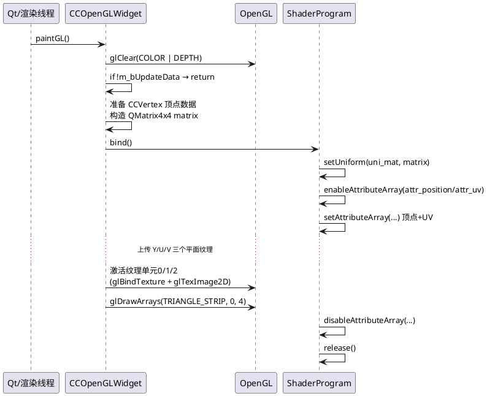
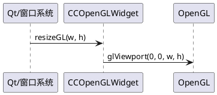
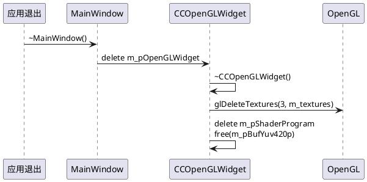

# QtClient OpenGL 渲染流程 - 面试讲解版（2-3分钟）

## 开场与核心思路

我在这个项目中用 OpenGL 来实现**实时视频渲染**，主要目的是**利用 GPU 并行处理能力，把 YUV420P 格式的视频数据转换成 RGB 并显示出来**。相比 CPU 转换，GPU 渲染性能更好，延迟更低。

---

## 完整流程（从初始化到渲染）

### 第一步：创建 OpenGL 组件（MainWindow 构造函数）

在 `mainwindow.cpp` 的构造函数里，我做了这几件事：

1. **创建 OpenGL 组件**：`m_pOpenGLWidget = new CCOpenGLWidget(this);`
   - 这里传入 `this` 作为父窗口，Qt 的对象树机制会管理生命周期
   - 此时只是 C++ 对象创建，**OpenGL 上下文还没创建**，不能调用任何 `glXXX` 函数

2. **加入布局**：在 `initUI()` 里把 `CCOpenGLWidget` 添加到视频显示区域的布局中

3. **设置回调**：创建 `CCVideoClient` 后，设置视频数据回调：
   ```cpp
   m_pVideoClient->SetupUpdateGUICallback(MainWindow::updateVideoData, (unsigned long)this);
   ```
   这样当网络层解码出 YUV 数据后，会回调到 `MainWindow::updateVideoData`，再转到 `CCOpenGLWidget::RendVideo`

### 第二步：OpenGL 初始化（Qt 自动调用 initializeGL）

当窗口 `show()` 后，Qt 会在**第一次需要绘制前**自动调用 `CCOpenGLWidget::initializeGL()`。这个函数我只重写一次，做三件事：

1. **初始化 OpenGL 函数指针**：`initializeOpenGLFunctions()`
   - 这是 Qt 封装的，必须最先调用，否则后续 `glGenTextures` 等函数会崩溃
   - 它内部会获取当前 OpenGL 上下文的函数指针

2. **生成纹理对象**：`glGenTextures(3, m_textures)`
   - 生成 3 个纹理 ID，分别用于 Y、U、V 三个平面
   - YUV420P 格式需要 3 个独立的纹理

3. **编译和链接着色器**：`initializeGLShaders()`
   - 从 Qt 资源文件加载顶点着色器 `vertex.vert` 和片段着色器 `fragment.frag`
   - 顶点着色器处理顶点位置和纹理坐标传递
   - 片段着色器负责 YUV 到 RGB 的转换（这是核心算法）
   - 通过 `QOpenGLShaderProgram` 的 `link()` 方法链接成完整的 Shader 程序

### 第三步：视频数据到达（RendVideo 函数）

当网络层解码出 `YUVData_Frame` 后，通过回调链：`updateVideoData` → `updateYUVFrame` → `RendVideo`。

在 `CCOpenGLWidget::RendVideo()` 里，我做的很简单：

1. **检查分辨率变化**：如果宽高变了，释放旧的缓冲区
2. **拷贝 YUV 数据**：用 `memcpy` 把 Y、U、V 三个平面数据拷贝到连续的内存缓冲区 `m_pBufYuv420p`
   - Y 平面是完整分辨率
   - U 和 V 平面各是 1/4 分辨率（YUV420P 的特点）
3. **标记并触发重绘**：设置 `m_bUpdateData = true`，调用 `update()` 请求 Qt 重绘

**关键点**：`RendVideo` 只做 CPU 侧的数据准备，**真正的 GPU 渲染在 `paintGL` 里完成**。

### 第四步：GPU 渲染（paintGL 函数）

`paintGL()` 是 Qt 在渲染线程里自动调用的，每帧都会执行。我的实现分几个步骤：

1. **清屏和检查**：
   - `glClear()` 清除颜色和深度缓冲
   - 如果 `m_bUpdateData` 为 false，直接返回（没有新数据就不渲染）

2. **准备顶点和矩阵**：
   - 定义 4 个顶点，覆盖整个屏幕（坐标 [-1,1]×[-1,1]），每个顶点带纹理坐标
   - 创建正交投影矩阵 `QMatrix4x4`，用于 2D 全屏渲染

3. **绑定 Shader 程序**：
   - `m_pShaderProgram->bind()` 激活 Shader
   - `setUniformValue("uni_mat", matrix)` 传递 MVP 矩阵
   - `enableAttributeArray` 和 `setAttributeArray` 设置顶点位置和纹理坐标属性

4. **上传 Y/U/V 三个纹理**：
   - 对每个纹理：`glActiveTexture` 激活纹理单元（0/1/2）
   - `glBindTexture` 绑定纹理对象
   - `glTexImage2D` 上传数据（Y 是完整分辨率，U/V 是半分辨率）
   - `glTexParameteri` 设置采样和环绕参数
   - `setUniformValue` 告诉 Shader 哪个纹理单元对应哪个采样器

5. **绘制**：
   - `glDrawArrays(GL_TRIANGLE_STRIP, 0, 4)` 绘制两个三角形组成矩形
   - 片段着色器会**并行处理每个像素**，采样 Y/U/V 纹理，用矩阵转换成 RGB，输出到屏幕

---

## 为什么用 OpenGL？

1. **性能优势**：YUV→RGB 转换在 GPU 中并行执行，比 CPU 循环快得多
2. **实时性**：避免 CPU 转换的延迟，直接渲染 YUV 数据
3. **可扩展性**：后续可以轻松在片段着色器中添加滤镜、亮度调整等效果

---

## 关键技术点总结

- **Qt 生命周期管理**：`initializeGL`、`resizeGL`、`paintGL` 由 Qt 自动调用，我只需要重写实现
- **数据分离**：CPU 侧准备数据（`RendVideo`），GPU 侧渲染（`paintGL`）
- **YUV420P 格式理解**：需要 3 个纹理，Y 平面完整，U/V 平面各 1/4
- **Shader 编程**：片段着色器中的 YUV→RGB 转换矩阵是关键算法

---


## QtClient 中 OpenGL 使用整体顺序图（文字 + UML）

### 1. 总体调用链（从程序启动到首帧渲染）

**文字版顺序：**

- **main.cpp**
  - 创建 `QApplication`
  - 创建 `MainWindow`
  - `w.show()` 之后，Qt 开始管理窗口与 `QOpenGLWidget` 生命周期

- **MainWindow 构造函数**
  - `ui->setupUi(this)`：加载 UI
  - `m_pOpenGLWidget = new CCOpenGLWidget(this)`：创建 OpenGL 视频显示组件，，/////两个继承
  - `initUI()`：把 `CCOpenGLWidget` 加到 `videoWidget` 布局中/////一个转换
  - 创建 `CCVideoClient`，设置回调：
    - 视频回调：`MainWindow::updateVideoData` → `updateYUVFrame` → `CCOpenGLWidget::RendVideo`

- **Qt OpenGL 生命周期（由 Qt 框架自动驱动）**重写继承的库函数
  - 第一次需要绘制时：调用 `CCOpenGLWidget::initializeGL`
  - 窗口大小变化时：调用 `CCOpenGLWidget::resizeGL`
  - 每次刷新：调用 `CCOpenGLWidget::paintGL`

- **视频数据到达后**
  - `CCVideoClient` 解码出 `YUVData_Frame`
  - 回调 `MainWindow::updateVideoData`，转到 `updateYUVFrame`
  - 调用 `CCOpenGLWidget::RendVideo`：
    - 拷贝 YUV 数据 → 设置 `m_bUpdateData = true` → 调用 `update()` 触发重绘
  - Qt 事件循环中触发 `paintGL`，完成一帧渲染


### 2. CCOpenGLWidget 内部 OpenGL 初始化流程

**文字版顺序：**

- **构造阶段**
  - `CCOpenGLWidget::CCOpenGLWidget(QWidget* parent)`：
    - 初始化成员：`m_pBufYuv420p = NULL`，`m_pShaderProgram = NULL`，宽高为 0
  - 此时 **OpenGL 上下文还未创建**，不能调 `glXXX`，只是做 C++ 成员初始化

- **OpenGL 环境初始化（Qt 首次调用）**
  - `initializeGL()` 关键步骤：
    - `initializeOpenGLFunctions()`  
      - **关键点**：Qt 的 `QOpenGLFunctions` 需要先初始化，内部获取当前上下文函数指针，否则后续 `glGenTextures` 等调用会崩
    - `glEnable(GL_DEPTH_TEST)`：启用深度测试（这里主要是通用初始化习惯）
    - `glClearColor(0.0, 0.0, 0.0, 1.0)`：设置清屏颜色为黑色
    - `glGenTextures(3, m_textures)`：生成 3 个纹理 ID，用于 Y/U/V 三个平面
    - `initializeGLShaders()`：编译、链接着色器程序

- **Shader 初始化 `initializeGLShaders()`**
  - 创建顶点着色器：`QOpenGLShader(QOpenGLShader::Vertex)`
  - `compileSourceFile(":/Shaders/vertex.vert")`
  - 创建片段着色器：`QOpenGLShader(QOpenGLShader::Fragment)`
  - `compileSourceFile(":/Shaders/fragment.frag")`
  - 创建 `QOpenGLShaderProgram`，`addShader` 顶点 & 片段着色器，调用 `link()` 链接
  - 释放临时 shader 对象，只保留 `QOpenGLShaderProgram`


---

### 3. 视频数据送入 OpenGL 的路径（从网络到 GPU）

**文字版顺序：**

- **网络 + 解码侧（非 OpenGL，但决定数据来源）**
  - `CCVideoClient` 接收 H.264 → 解码为 `YUV420P` → 放入视频队列
  - 音视频同步线程根据时间戳，从队列取 `YUVData_Frame` 调用回调

- **回调到 GUI/渲染侧：**
  - 静态回调 `MainWindow::updateVideoData(YUVData_Frame* frame, userData)`
    - 用 `userData` 强转回 `MainWindow*`
    - 调用成员函数 `updateYUVFrame(frame)`
  - `MainWindow::updateYUVFrame`：
    - 判断 `m_pOpenGLWidget` 是否非空
    - 调用 `m_pOpenGLWidget->RendVideo(yuvFrame)`

- **RendVideo 内部逻辑：**
  - 若分辨率变化：释放旧 `m_pBufYuv420p`，更新 `m_nVideoW/H`
  - 计算 Y、U、V 各平面长度，计算总长度
  - `malloc` 分配/复用 `m_pBufYuv420p` 缓冲
  - `memcpy` 拷贝三段数据到连续缓冲（Y | U | V）
  - 设置 `m_bUpdateData = true`
  - 调用 `update()` 触发 Qt 重绘事件


---

### 4. 单帧渲染内部的 OpenGL 调用顺序（paintGL）

**文字版顺序：**

- **入口检查：**
  - `glClear(GL_COLOR_BUFFER_BIT | GL_DEPTH_BUFFER_BIT)`：清屏
  - `glLoadIdentity()`：重置当前矩阵（兼容固定管线风格）
  - 若 `m_bUpdateData == false`：直接返回，不渲染

- **准备顶点数据 + 矩阵：**
  - 定义四个顶点 `CCVertex triangleVert[4]`：
    - 坐标覆盖 [-1,1]×[-1,1]，对应整个视口
    - 每个顶点附带 `u,v` 纹理坐标 [0,1]
  - 创建 `QMatrix4x4 matrix`：
    - `matrix.ortho(-1,1,-1,1,0.1,1000)`：正交投影
    - `matrix.translate(0,0,-3)`：整体往 Z 轴负方向平移

- **使用 Shader 程序：**
  - `m_pShaderProgram->bind()`
  - `setUniformValue("uni_mat", matrix)`
  - `enableAttributeArray("attr_position")`
  - `enableAttributeArray("attr_uv")`
  - `setAttributeArray("attr_position", GL_FLOAT, triangleVert, 3, sizeof(CCVertex))`
  - `setAttributeArray("attr_uv", GL_FLOAT, &triangleVert[0].u, 2, sizeof(CCVertex))`

- **上传 Y/U/V 三个纹理：**
  - Y：
    - `setUniformValue("uni_textureY", 0)`
    - `glActiveTexture(GL_TEXTURE0)`
    - `glBindTexture(GL_TEXTURE_2D, m_textures[0])`
    - `glPixelStorei(GL_UNPACK_ALIGNMENT, 1)`
    - `glTexImage2D(..., GL_LUMINANCE, m_nVideoW, m_nVideoH, ..., m_pBufYuv420p)`
    - 设置采样/环绕参数 `glTexParameteri(...)`
  - U：
    - 同理，纹理单元 1，尺寸 `m_nVideoW/2, m_nVideoH/2`，数据指针偏移到 U 起始
  - V：
    - 同理，纹理单元 2，尺寸 `m_nVideoW/2, m_nVideoH/2`，数据指针偏移到 V 起始

- **绘制与收尾：**
  - `glDrawArrays(GL_TRIANGLE_STRIP, 0, 4)`：两个三角形组成一个矩形
  - 关闭属性数组：`disableAttributeArray("attr_position/attr_uv")`
  - `m_pShaderProgram->release()`

**UML 顺序图代码（PlantUML）：**



---

### 5. 视口与窗口尺寸变化流程（resizeGL）

**文字版顺序：**

- 当窗口大小变化时，Qt 自动调用 `resizeGL(int w, int h)`：
  - 这里的实现很简单：`glViewport(0, 0, w, h)`
  - 含义：OpenGL 的绘制区域随窗口大小变化，始终填满整个 `QOpenGLWidget` 区域
  - 渲染逻辑不变（`paintGL` 仍绘制 [-1,1] 全屏矩形），只是结果被缩放到新的视口尺寸

**简单 UML（PlantUML）：**



---

### 6. OpenGL 资源释放流程（析构）

**文字版顺序：**

- **MainWindow 析构：**
  - `delete m_pOpenGLWidget` → 触发 `CCOpenGLWidget::~CCOpenGLWidget`

- **CCOpenGLWidget 析构：**
  - 若 `m_pShaderProgram != NULL`：
    - `delete m_pShaderProgram`，释放 GPU 上的着色器程序资源
  - 若 `m_pBufYuv420p != NULL`：
    - `free(m_pBufYuv420p)`，释放 CPU 侧 YUV 缓冲
  - `glDeleteTextures(3, m_textures)`：释放 GPU 上的 3 个纹理对象

**UML 顺序图代码（PlantUML）：**



---

### 7. 面试/自我讲解时可以怎么说（提炼版）

- **从入口讲顺序：**
  - 程序启动 → 创建 `MainWindow` → 内部创建一个 `CCOpenGLWidget` 作为视频显示窗口
  - 第一次渲染时 Qt 会自动调用 `initializeGL`，在这里我完成 OpenGL 环境初始化、纹理和 Shader 设置
  - 网络层解码出 YUV420P 帧之后，通过回调把 `YUVData_Frame` 传给 `CCOpenGLWidget::RendVideo`
  - `RendVideo` 做的事情很简单：**CPU 侧拷贝 YUV 数据 + 标记有新数据 + 请求重绘**
  - 真正的 GPU 渲染在 `paintGL` 里完成：上传三路 Y/U/V 纹理，用 Shader 在片段着色器中做 YUV→RGB 转换，然后画一个全屏矩形

- **关键 API 和作用：**
  - `initializeOpenGLFunctions()`：初始化 Qt 封装的 OpenGL 函数指针
  - `glGenTextures / glBindTexture / glTexImage2D`：创建并上传 Y/U/V 三个纹理
  - `QOpenGLShader / QOpenGLShaderProgram`：加载、编译、链接 Shader
  - `update()` + `paintGL()`：Qt 的重绘机制，保证在渲染线程里调用 OpenGL
  - `glViewport`：窗口变化时调整视口，保证画面铺满

